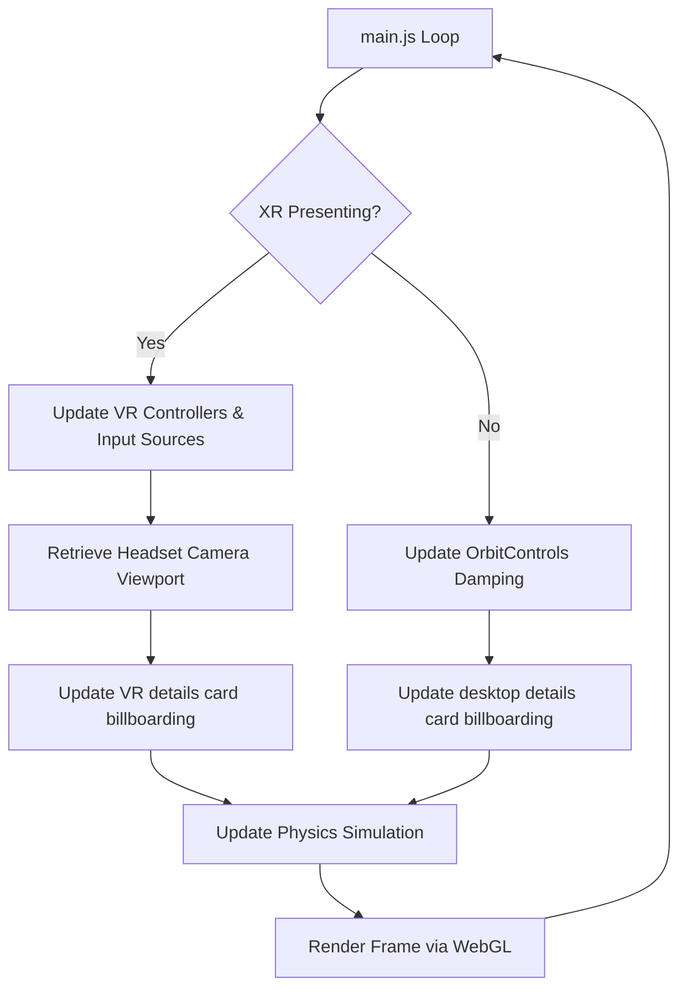

# Sentinal3D // Technical Specification

This document details the software design, mathematical models, coordinate system translations, and interactive canvas mappings implemented in the Sentinal3D Lawful Intercept Link Chart Viewer.

---

## 1. Core 3D Render Loop & WebXR Presentation

The application is built on top of the **Three.js** WebGL framework, leveraging the browser's native **WebXR Device API** for immersive virtual reality rendering.



### Animating in WebXR
Because standard `requestAnimationFrame` is paused when a browser enters WebXR immersive mode, the main render loop is driven by the WebGL renderer's animation scheduler:
```javascript
renderer.setAnimationLoop(tick);
```
During VR presentation, `renderer.xr.getCamera(camera)` is queried to retrieve the active stereoscopic headset matrices. The camera position is used for real-time card billboarding, rotating the canvas-textures to face the user.

---

## 2. Physics Simulation Model

Sentinal3D implements a **3D Force-Directed Layout Engine** using a relaxation solver. At each clock tick, three distinct forces are computed for every node $i$:

### Force Equations

1. **Repulsive Force (Coulomb-like)**:
   All nodes repel each other to prevent overlap and maintain clarity. The force vector $\vec{F}_{rep}$ acting on node $i$ from node $j$ is:
   $$\vec{F}_{rep}(i, j) = \frac{K_r}{d^2} \cdot \hat{u}_{ji}$$
   Where:
   * $K_r$ is the repulsion coefficient (set to `0.15`).
   * $d$ is the Euclidean distance in 3D space between node $i$ and node $j$.
   * $\hat{u}_{ji}$ is the normalized unit direction vector pointing from node $j$ to node $i$.

2. **Attractive Force (Hooke's Law)**:
   Nodes connected by an edge (communication link) are pulled together. The force vector $\vec{F}_{att}$ acting on node $i$ from connected node $j$ is:
   $$\vec{F}_{att}(i, j) = K_a \cdot (d - d_{rest}) \cdot \hat{u}_{ij}$$
   Where:
   * $K_a$ is the spring stiffness coefficient (set to `0.08`).
   * $d_{rest}$ is the spring resting length (set to `0.7` meters).
   * $\hat{u}_{ij}$ is the normalized unit direction vector pointing from node $i$ to node $j$.

3. **Center Gravity Force**:
   To keep disconnected groups from drifting off to infinity, a global weak gravity force pulls all nodes toward the visual center of the coordinate space $\vec{C} = (0, 1.5, -1.5)$:
   $$\vec{F}_{grav}(i) = K_g \cdot (\vec{C} - \vec{P}_i)$$
   Where $K_g$ is the gravity coefficient (`0.015`) and $\vec{P}_i$ is the position of node $i$.

### State Integration & Bypassing
Once forces are summed, velocities and positions are integrated:
$$\vec{V}_i(t + \Delta t) = (\vec{V}_i(t) + \vec{F}_{total}(i)) \cdot \text{damping}$$
$$\vec{P}_i(t + \Delta t) = \vec{P}_i(t) + \vec{V}_i(t + \Delta t)$$
Where $\text{damping} = 0.82$ prevents wild oscillations.

* **Bypass Rule**: If a node has `isDragged === true` or `isPinned === true`, its velocity vector is reset to zero and the integration step is bypassed. Pinned nodes remain statically locked at their coordinates but continue to emit repulsive forces, acting as solid anchor points around which the remaining unpinned network flows.

---

## 3. Coordinate Systems Translation

To support smooth navigation (rotation, scaling, panning) without displacing the viewer's physical bounds, all graph meshes are children of a unified `graphGroup` (`THREE.Group`). This introduces two coordinate spaces: **World Space** and **Local Graph Space**.

```
[World Origin: 0, 0, 0]
    └── [Camera / Headset / Laser Rays (World coordinates)]
    └── [graphGroup: translated by Pan, rotated by Joystick X, scaled by Joystick Y]
             └── [Nodes & Edges: local coordinates relative to graphGroup]
```

### WebXR Controller Grabbing (`attach` / `detach`)
When a VR controller selects a node, Three.js's `.attach()` utility handles parent transitions while preserving world-space transformations:
1. **On Grab**: 
   `controller.attach(nodeMesh)` detaches `nodeMesh` from `graphGroup` and adds it as a child of the controller, automatically modifying the node's local position matrix so it stays visually locked to the controller handle.
2. **On Release**:
   `graphGroup.attach(nodeMesh)` detaches the node from the controller and returns it to the `graphGroup`. Three.js automatically applies the inverse matrix of `graphGroup` to compute the node's new local coordinates inside the scaled/rotated group.

### Desktop Dragging (`worldToLocal`)
In desktop mode, mouse coordinates are projected onto a virtual drag plane parallel to the camera. The resulting intersection point $\vec{I}_{world}$ is in world space. To translate the dragged node:
1. The world intersection vector is cloned:
   $$\vec{I}_{local} = \text{graphGroup.worldToLocal}(\vec{I}_{world})$$
2. The node's position is updated:
   $$\vec{P}_{node} = \vec{I}_{local}$$

---

## 4. Interactive Canvas Texture Mapping

Because WebXR does not support standard HTML DOM overlays in fully immersive mode, the floating 3D Details Card and Control Console are rendered using **CanvasTextures**.

### Raycast UV Coordinate Projection
WebGL textures are mapped onto geometries using UV coordinates $(u, v)$ where $u, v \in [0, 1]$. To register button clicks in 3D:
1. The laser pointer intersects the `PlaneGeometry` representing the card or console.
2. The intersection result returns the precise hit UV coordinate, e.g., $(0.72, 0.45)$.
3. The coordinate is mapped directly to the 2D canvas pixel coordinates:
   $$X_{pixel} = u \cdot W_{canvas}$$
   $$Y_{pixel} = (1 - v) \cdot H_{canvas}$$
   Where $W_{canvas}$ and $H_{canvas}$ are the dimensions of the backing canvas (e.g., $512 \times 256$ pixels).
4. The system checks if $(X_{pixel}, Y_{pixel})$ resides within any defined button bounding boxes:
   $$X_{btn} \le X_{pixel} \le X_{btn} + W_{btn}$$
   $$Y_{btn} \le Y_{pixel} \le Y_{btn} + H_{btn}$$
5. If true, the button triggers hover states or execution callbacks.

---

## 5. State Syncing & Custom Events

To bridge actions taken inside the WebGL/WebXR context (such as clicking the red **UNPIN** button on a 3D Details Card) with the desktop HTML DOM sidebar inspector, a custom event system is utilized:

1. **Triggering from WebXR**:
   When a user clicks "UNPIN" on the 3D details card, `VRInterface` dispatches a custom event:
   ```javascript
   const event = new CustomEvent('node-unpinned', { detail: nodeData });
   document.dispatchEvent(event);
   ```
2. **Listening on Desktop**:
   `InteractionHandler` listens to the event, updates the target node's physics state, and refreshes the desktop sidebar DOM dynamically:
   ```javascript
   document.addEventListener('node-unpinned', (e) => {
     const node = e.detail;
     node.isPinned = false;
     if (selectedObject && selectedObject.userData.id === node.id) {
       inspectObjectOnDesktop(node); // Hides pin badge & unpin button
     }
   });
   ```
This event loop maintains strict state synchronization between the immersive VR headset view and the desktop dashboard controls.
